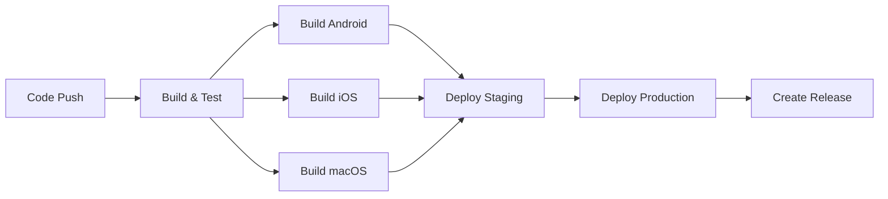

# 📱 MauiApp1 - Cross-Platform Mobile App

A .NET MAUI application that runs on Android, iOS, and macOS platforms.

## 🚀 CI/CD Pipeline Status


## 🏗️ Build & Deployment

This project includes a comprehensive CI/CD pipeline using GitHub Actions that:

### 🔄 Continuous Integration (CI)
- **Automatic builds** on every push and pull request
- **Multi-platform compilation** (Android, iOS, macOS)
- **Automated testing** (when tests are available)
- **Code quality checks**
- **Artifact generation** for all platforms

### 🚢 Continuous Deployment (CD)
- **Staging deployments** on `develop` branch
- **Production deployments** on `main` branch
- **Automatic app store submissions** (when configured)
- **GitHub releases** with downloadable artifacts

## 📦 Supported Platforms

| Platform | Framework | Status |
|----------|-----------|--------|
| 🤖 Android | `net9.0-android` | ✅ Ready |
| 🍎 iOS | `net9.0-ios` | ✅ Ready |
| 💻 macOS | `net9.0-maccatalyst` | ✅ Ready |
| 🪟 Windows | `net9.0-windows` | ⚠️ Available on Windows |

## 🛠️ Development Workflow

### Branching Strategy
- `main` → Production releases
- `develop` → Staging/testing
- `feature/*` → Feature development

### Automated Processes
1. **Push to `develop`** → Build + Deploy to staging
2. **Push to `main`** → Build + Deploy to production + Create release
3. **Pull requests** → Build + Test validation

## 🏃‍♂️ Getting Started

### Prerequisites
- .NET 9.0 SDK
- MAUI workload: `dotnet workload install maui`

### Local Development
```bash
# Clone the repository
git clone <your-repo-url>
cd MauiApp1

# Restore packages
dotnet restore

# Build for specific platform
dotnet build -f net9.0-android    # Android
dotnet build -f net9.0-ios        # iOS
dotnet build -f net9.0-maccatalyst # macOS

# Publish for release
dotnet publish -f net9.0-android -c Release    # Android APK
dotnet publish -f net9.0-maccatalyst -c Release # macOS App
```

## 📱 Installation

### Android
- Download the APK from the latest [GitHub Release](../../releases)
- Enable "Install from Unknown Sources" on your device
- Install the APK

### macOS
- Download the `.app` file from the latest [GitHub Release](../../releases)
- Extract and move to Applications folder
- Run the app

### iOS
- Distributed through TestFlight or App Store
- Contact developers for TestFlight access

## 🔧 CI/CD Configuration

### Environment Secrets Required
For full CI/CD functionality, configure these secrets in your GitHub repository:

#### App Store Deployment
- `APPLE_ID` - Your Apple Developer ID
- `APPLE_PASSWORD` - App-specific password
- `APPLE_TEAM_ID` - Your Apple Developer Team ID

#### Google Play Deployment
- `GOOGLE_PLAY_SERVICE_ACCOUNT` - Service account JSON
- `GOOGLE_PLAY_TRACK` - Release track (internal/alpha/beta/production)

#### Firebase App Distribution
- `FIREBASE_TOKEN` - Firebase CLI token
- `FIREBASE_APP_ID` - Your Firebase app ID

### Workflow Triggers
- **Push to main/develop** → Full CI/CD pipeline
- **Pull requests to main** → Build and test only
- **Manual trigger** → Available for emergency deployments

## 📊 Pipeline Stages



## 🔍 Monitoring & Analytics

- **Build status**: Check GitHub Actions tab
- **App performance**: Configure Application Insights
- **Crash reporting**: Integrated with platform-specific tools

## 🤝 Contributing

1. Fork the repository
2. Create a feature branch: `git checkout -b feature/amazing-feature`
3. Commit changes: `git commit -m 'Add amazing feature'`
4. Push to branch: `git push origin feature/amazing-feature`
5. Open a Pull Request

The CI/CD pipeline will automatically:
- Build your changes
- Run tests
- Provide feedback on the PR

## 📄 License

This project is licensed under the MIT License - see the [LICENSE](LICENSE) file for details.

## 🆘 Support

- **Issues**: Report bugs via [GitHub Issues](../../issues)
- **Discussions**: Ask questions in [GitHub Discussions](../../discussions)
- **Documentation**: Check the [Wiki](../../wiki)

---

**Built with ❤️ using .NET MAUI and automated with GitHub Actions**